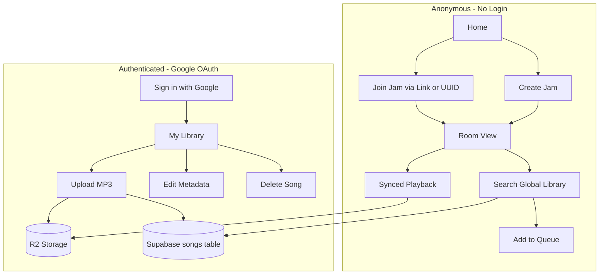
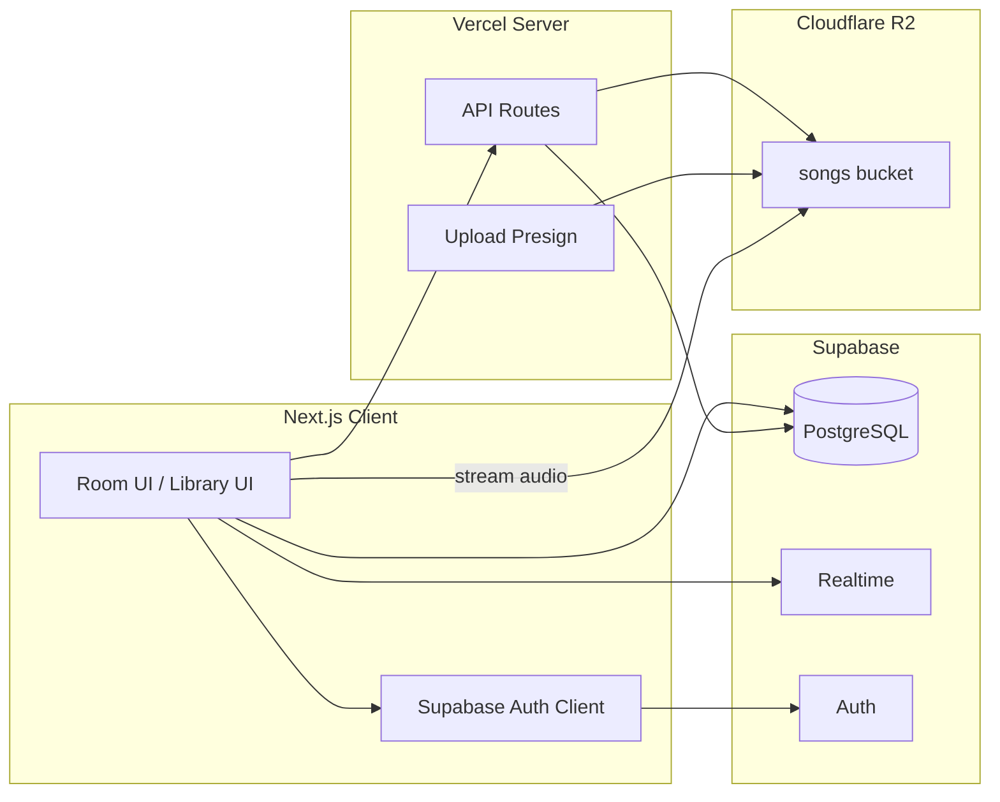
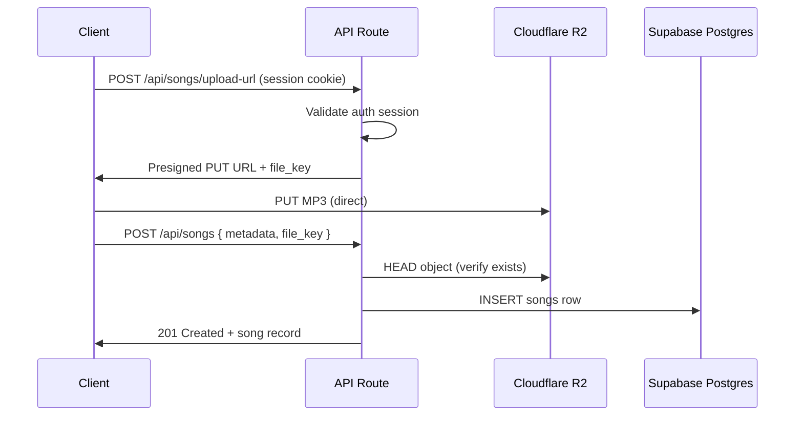
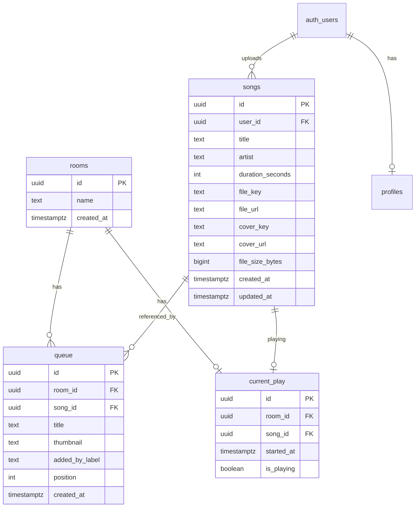

# Jam Room App — Product Requirements Document

| Field | Value |
| --- | --- |
| **Product name** | Jam Room App (working title) |
| **Version** | 1.0 |
| **Status** | Draft — pending stakeholder review |
| **Last updated** | 2026-06-13 |
| **Author** | Product / Engineering |

### Related codebase files

| File | Role today |
| --- | --- |
| [supabase/schema.sql](../supabase/schema.sql) | Postgres schema: `rooms`, `queue`, `current_play` |
| [components/room/RoomClient.tsx](../components/room/RoomClient.tsx) | Room UI, Realtime sync, queue ops, playback orchestration |
| [lib/jamHost.ts](../lib/jamHost.ts) | Client-side host flag (`localStorage`) |
| [lib/jamContributorIdentity.ts](../lib/jamContributorIdentity.ts) | Anonymous contributor labels for queue items |
| [hooks/usePlaybackMode.ts](../hooks/usePlaybackMode.ts) | Guest `follow_host` vs `local` playback mode |
| [store/jamStore.ts](../store/jamStore.ts) | Zustand: `roomId`, `queue`, `currentVideo` |
| [lib/types.ts](../lib/types.ts) | Shared TypeScript types |
| [components/room/YouTubePlayer.tsx](../components/room/YouTubePlayer.tsx) | YouTube IFrame player (to be replaced) |
| [components/room/RoomYouTubeSearch.tsx](../components/room/RoomYouTubeSearch.tsx) | YouTube search in room (to be replaced) |
| [app/api/youtube/search/route.ts](../app/api/youtube/search/route.ts) | Server-side YouTube API proxy (to be removed) |

---

## Changelog

Record amendments here before Phase 1 implementation. Do not change requirements silently — update this table and bump the PRD version when scope changes.

| Date | Version | Author | Change |
| --- | --- | --- | --- |
| 2026-06-13 | 1.0 | — | Initial PRD: pivot from YouTube to Supabase + Cloudflare R2 |

---

## Table of contents

1. [Executive summary](#1-executive-summary)
2. [Problem statement](#2-problem-statement)
3. [Goals and non-goals](#3-goals-and-non-goals)
4. [User personas and roles](#4-user-personas-and-roles)
5. [Core user flows](#5-core-user-flows)
6. [Functional requirements](#6-functional-requirements)
7. [Technical architecture](#7-technical-architecture)
8. [Data model](#8-data-model)
9. [Security and RLS](#9-security-and-rls)
10. [Storage estimates](#10-storage-estimates)
11. [UI pages and components](#11-ui-pages-and-components)
12. [Codebase migration map (YouTube → audio)](#12-codebase-migration-map-youtube--audio)
13. [Migration strategy](#13-migration-strategy)
14. [Legal and content policy](#14-legal-and-content-policy)
15. [Success metrics](#15-success-metrics)
16. [Implementation phases](#16-implementation-phases)
17. [Open questions and future enhancements](#17-open-questions-and-future-enhancements)
18. [Appendix: wireframe descriptions](#appendix-wireframe-descriptions)
19. [Appendix: error states](#appendix-error-states)

---

## 1. Executive summary

Jam Room App is a collaborative “listen together” web application. Users create or join **jam rooms**, build a shared **queue**, and stay in sync on **playback** (play, pause, seek, next track) via Supabase Realtime.

**This PRD defines a pivot from the current YouTube-based MVP to a self-hosted music library:**

| Layer | Technology |
| --- | --- |
| Audio files | **Cloudflare R2** (object storage) |
| Metadata, rooms, queue, auth, Realtime | **Supabase** (PostgreSQL + Auth + Realtime) |
| Frontend / API | **Next.js 14** on Vercel |

**Key product decisions:**

- **Jam rooms stay anonymous** — creating a room, hosting, and joining require **no login**.
- **Google OAuth** (via Supabase Auth) is required **only** to upload and manage personal tracks. Register and login are the same flow (first Google sign-in creates the account).
- **All uploaded tracks are public** — any visitor (logged in or not) can search the global catalog and queue any track in any jam room.
- Authenticated uploaders can **edit metadata** (title, artist, cover) and **delete** their own songs in v1.

Architecture choice: **Option 2 — Supabase (DB + Auth + Realtime) + Cloudflare R2 (audio files)** for scalability on free tiers (~2,500+ MP3 tracks, free R2 egress for streaming).

---

## 2. Problem statement

The current MVP streams music through **YouTube** (`video_id`, `react-youtube`, YouTube Data API). That approach has several limitations:

| Issue | Impact |
| --- | --- |
| YouTube API dependency | Requires server API key, quota limits, external service risk |
| Embed constraints | IFrame player, autoplay/mute policies, PiP tied to video embed |
| Copyright | Users cannot legally upload and share owned audio through YouTube search |
| No owned catalog | No persistent library of user-contributed tracks |
| Egress on Supabase | Not an issue today (YouTube hosts media), but would be if files were stored in Supabase Storage at scale |

The new MVP needs a **free-tier-friendly**, **scalable** storage model where users contribute their own MP3 files while preserving the existing collaborative jam-room experience.

---

## 3. Goals and non-goals

### 3.1 Goals (v1)

| # | Goal |
| --- | --- |
| G1 | Replace YouTube playback with HTML5 audio streamed from Cloudflare R2 |
| G2 | Preserve collaborative jam-room UX: host, guest, queue, Realtime sync, transport controls |
| G3 | Google OAuth for upload; anonymous access for listening and jamming |
| G4 | Global public song library, searchable from within a jam room |
| G5 | Upload, edit metadata, and delete own songs |
| G6 | Supabase + R2 from day one for storage scalability |

### 3.2 Non-goals (v1)

| # | Out of scope |
| --- | --- |
| NG1 | Email/password or OAuth providers other than Google |
| NG2 | Private or restricted songs; per-user libraries hidden from others |
| NG3 | Playlists or libraries outside jam rooms |
| NG4 | In-app audio transcoding or format conversion |
| NG5 | Content moderation pipeline beyond file-type and size validation |
| NG6 | Native mobile apps |
| NG7 | Paid tiers, billing, or usage dashboards |
| NG8 | DMCA takedown workflow (noted for future) |

---

## 4. User personas and roles

### 4.1 Roles

| Role | Auth | Capabilities |
| --- | --- | --- |
| **Anonymous guest** | None | Join jam by link/UUID; search global library; add tracks to queue; drag-reorder queue; play/pause sync; choose `follow_host` or `local` audio mode |
| **Anonymous host** | None | Create jam room; all guest capabilities; host-only UX (unmuted local playback; PiP if feasible); copy invite link |
| **Authenticated uploader** | Google OAuth | All anonymous capabilities + upload MP3; edit own metadata; delete own songs; **My Library** page |

### 4.2 Host identification (unchanged)

The browser that **creates** a room is treated as host via `localStorage`, not server-side auth.

- Set on create: `markJamRoomHost(roomId)` in [lib/jamHost.ts](../lib/jamHost.ts)
- Checked in room: `isJamRoomHost(roomId)`
- Storage key pattern: `jam-room-host-{roomId}`

**Implication:** Host role is a UX convenience (unmuted playback, PiP toggle), not a security boundary. Any client can still mutate queue/`current_play` under current MVP RLS.

### 4.3 Contributor label (unchanged)

Anonymous display name per browser for queue attribution, e.g. `"🦦 Lumivex"`.

- Implemented in [lib/jamContributorIdentity.ts](../lib/jamContributorIdentity.ts)
- Stored on `queue.added_by_label` at insert time

### 4.4 Playback modes (unchanged)

From [hooks/usePlaybackMode.ts](../hooks/usePlaybackMode.ts):

| Mode | Who | Behavior |
| --- | --- | --- |
| `local` | Host (always); guest (optional) | Unmuted audio on this device |
| `follow_host` | Guest (default) | Muted player synced to `current_play.started_at` wall-clock seek |

---

## 5. Core user flows

### 5.1 Flow diagram



### 5.2 Flow A — Create jam (anonymous)

1. User enters room name on home page ([HomePageClient.tsx](../components/home/HomePageClient.tsx)).
2. App inserts row into `rooms` via Supabase client.
3. App calls `markJamRoomHost(roomId)`.
4. Redirect to `/room/[id]`.
5. User copies invite link (`/room/{uuid}`) or room UUID.

### 5.3 Flow B — Join jam (anonymous)

1. User opens `/room/[id]` directly, or home with `?room=<uuid>` to prefill join field.
2. App loads room name, queue, and `current_play`.
3. App subscribes to Realtime on `queue` and `current_play` for that `room_id`.
4. If queue has items but nothing is playing, first item is promoted to `current_play` (see [RoomClient.tsx](../components/room/RoomClient.tsx) `ensureCurrentFromQueue`).

### 5.4 Flow C — Add track to queue (anonymous)

1. User types in room search (min 2 characters, debounced).
2. App queries global `songs` table (title/artist).
3. User picks a result.
4. App inserts `queue` row: `song_id`, denormalized `title`, `thumbnail` (cover URL), `added_by_label`, `position = max(position)+1`.
5. If nothing is currently playing, promote this track to `current_play`.

### 5.5 Flow D — Upload track (Google OAuth)

1. User clicks **Sign in with Google** (header or My Library gate).
2. Supabase Auth completes OAuth; session stored in browser.
3. User navigates to **My Library** (`/library`).
4. User selects MP3 file and enters title (required) and artist (optional).
5. Client calls `POST /api/songs/upload-url` with filename and content-type.
6. Server validates session, returns presigned PUT URL for R2 key `songs/{user_id}/{uuid}.mp3`.
7. Client uploads file directly to R2 with progress indicator.
8. Client optionally uploads cover to `covers/{user_id}/{uuid}.{ext}`.
9. Client calls `POST /api/songs` with metadata and R2 keys.
10. Server verifies object exists, inserts `songs` row; track appears in global catalog immediately.

### 5.6 Flow E — Manage own tracks (Google OAuth)

1. **My Library** lists songs where `user_id = auth.uid()`.
2. **Edit:** user changes title, artist, and/or cover image; app updates DB and R2 as needed.
3. **Delete:** user confirms deletion; server removes R2 objects, deletes `songs` row, removes all `queue` rows referencing the song; if song was `current_play`, room advances to next queue item.

---

## 6. Functional requirements

Each requirement includes a priority (**Must** / **Should** / **Could**) and **acceptance criteria**.

### 6.1 Jam room (preserve current behavior)

Reference: [README.md](../README.md) — “How it works (MVP)”.

| ID | Requirement | Priority | Acceptance criteria |
| --- | --- | --- | --- |
| JR-01 | Create room without login | Must | Home “Create room” succeeds with only Supabase anon key; no auth redirect |
| JR-02 | Join room via UUID or direct link | Must | `/room/[id]` and `/?room=<uuid>` both work; invalid UUID shows error |
| JR-03 | Realtime sync on `queue` and `current_play` | Must | Two browsers in same room see queue/play state update within ~2s without refresh |
| JR-04 | Auto-promote first queue item when idle | Must | Empty `current_play` + non-empty queue → first item becomes `current_play` with `is_playing: true` |
| JR-05 | Play/pause synced via `current_play.is_playing` | Must | Host/guest pressing play/pause updates DB; all clients apply to audio element |
| JR-06 | Advance queue on track end + manual Next | Must | `onEnded` and Next button remove head of queue and upsert next `song_id` into `current_play` |
| JR-07 | Drag-and-drop queue reorder | Must | Reorder updates `position`; order consistent across clients via Realtime |
| JR-08 | Host: always local unmuted playback | Must | `isJamRoomHost` → playback mode locked to `local`; audio not muted |
| JR-09 | Guest: `follow_host` (default) or `local` | Must | Toggle persists in `localStorage`; follow mode mutes and seeks from `started_at` |
| JR-10 | Contributor label on queued items | Must | New queue rows include `added_by_label` from contributor identity |
| JR-11 | Copy invite link / room ID | Must | Clipboard copy with 2s success feedback (existing pattern in RoomClient) |
| JR-12 | Host Picture-in-Picture | Should | Evaluate HTML5 audio PiP; defer if unsupported — document decision in changelog |

### 6.2 Playback engine (new)

| ID | Requirement | Priority | Acceptance criteria |
| --- | --- | --- | --- |
| PB-01 | Replace `YouTubePlayer` with `AudioPlayer` | Must | No YouTube IFrame in room; HTML5 `<audio>` element drives playback |
| PB-02 | Sync seek from `current_play.started_at` | Must | Guest in `follow_host` seeks to `wallElapsedSeconds(started_at)` on load and on Realtime updates |
| PB-03 | Queue references `song_id` not `video_id` | Must | Schema and types use `song_id`; no `video_id` in queue/current_play |
| PB-04 | Stream audio from R2 | Must | Audio `src` resolves to R2 URL (signed GET preferred); playback starts for valid files |
| PB-05 | Show cover, title, artist in player | Must | Now-playing UI shows metadata from `songs` or denormalized queue row |
| PB-06 | Handle track load errors | Must | On `error` event: show user-visible message; optional auto-skip to next (document chosen behavior) |

### 6.3 Song library

| ID | Requirement | Priority | Acceptance criteria |
| --- | --- | --- | --- |
| SL-01 | Global searchable catalog | Must | All `songs` rows readable by anon; no per-user filter in room search |
| SL-02 | Search by title and artist | Must | Min 2 chars; 350ms debounce (match existing YouTube search UX) |
| SL-03 | Cover thumbnail in results | Must | Each result shows `cover_url` or placeholder if null |
| SL-04 | Limited results | Must | Return at most 10–20 matches per query |

### 6.4 Upload and management (auth required)

| ID | Requirement | Priority | Acceptance criteria |
| --- | --- | --- | --- |
| UP-01 | Sign in with Google only | Must | Supabase Google provider; no email/password UI |
| UP-02 | Accept MP3 only | Must | Reject non-`audio/mpeg` / non-`.mp3` with clear error before upload |
| UP-03 | Max file size 50 MB | Must | Reject larger files client-side and server-side |
| UP-04 | Title required; artist optional | Must | Cannot complete upload without title |
| UP-05 | Optional cover image | Should | JPEG/PNG/WebP; max 2 MB |
| UP-06 | Edit title, artist, cover | Must | Owner can update; changes visible in catalog and future queue adds |
| UP-07 | Delete own songs | Must | Non-owner receives 403; owner delete removes R2 + DB |
| UP-08 | Delete cascades queue / current play | Must | All `queue` rows with that `song_id` removed; if playing, `advanceToNextTrack` logic runs |
| UP-09 | Upload progress indicator | Should | Visible percentage or indeterminate progress during R2 PUT |

### 6.5 Authentication

| ID | Requirement | Priority | Acceptance criteria |
| --- | --- | --- | --- |
| AU-01 | Supabase Auth + Google OAuth | Must | Google sign-in button triggers `signInWithOAuth({ provider: 'google' })` |
| AU-02 | No email/password in v1 | Must | No signup form or magic link UI |
| AU-03 | Session persist + sign out | Must | Refresh keeps session; sign out clears session and redirects appropriately |
| AU-04 | Auth gate on upload/edit/delete only | Must | `/library` and upload API return 401 without session; room pages load without session |
| AU-05 | Jam routes public | Must | `/`, `/room/[id]` accessible without login |

---

## 7. Technical architecture

### 7.1 System diagram



### 7.2 Stack

| Layer | Technology | Notes |
| --- | --- | --- |
| Frontend | Next.js 14 App Router, TypeScript, Tailwind, Zustand | Existing |
| Database | Supabase PostgreSQL | Rooms, queue, songs, profiles |
| Realtime | Supabase Realtime | `queue`, `current_play` |
| Auth | Supabase Auth | Google OAuth only |
| Object storage | Cloudflare R2 | MP3 + cover images |
| Hosting | Vercel | API routes for presign and song CRUD |

**Remove from stack:** `react-youtube`, YouTube Data API, `/api/youtube/search`, PiP embed pages if YouTube-only ([app/pip-embed/](../app/pip-embed/)).

### 7.3 Environment variables

| Variable | Scope | Purpose |
| --- | --- | --- |
| `NEXT_PUBLIC_SUPABASE_URL` | Public | Supabase project URL (existing) |
| `NEXT_PUBLIC_SUPABASE_ANON_KEY` | Public | Supabase anon key (existing) |
| `R2_ACCOUNT_ID` | Server | Cloudflare account ID |
| `R2_ACCESS_KEY_ID` | Server | R2 API token access key |
| `R2_SECRET_ACCESS_KEY` | Server | R2 API token secret |
| `R2_BUCKET_NAME` | Server | e.g. `jam-songs` |
| `R2_PUBLIC_URL` | Server / optional public | Custom domain or public bucket URL for streaming |

**Remove:** `YOUTUBE_API_KEY`

Update [.env.example](../.env.example) during implementation.

### 7.4 Upload pipeline (recommended)



**Alternative:** server-side multipart through API route — simpler client, but constrained by Vercel body size limits and slower for large files. Not recommended for v1.

### 7.5 Audio URL strategy

| Approach | Pros | Cons |
| --- | --- | --- |
| **Signed GET URLs** (recommended) | Private bucket; TTL control; revocable | Requires API call or refresh before expiry |
| **Public bucket / custom domain** | Simple `src` URLs | Less control; hotlinking |

**v1 default:** Signed GET with 1–4 hour TTL; client refreshes URL on play if expired. Document final choice in changelog when implemented.

### 7.6 Sync model (unchanged concept)

Playback position is derived from wall clock, not per-client timestamps:

```
elapsedSeconds = (now - current_play.started_at) / 1000
```

When pausing, implementation must reset or offset `started_at` so elapsed time freezes (match existing YouTube pause behavior in RoomClient).

---

## 8. Data model

### 8.1 Entity relationship



### 8.2 Table: `songs` (new)

```sql
create table public.songs (
  id uuid primary key default gen_random_uuid(),
  user_id uuid not null references auth.users (id) on delete cascade,
  title text not null,
  artist text,
  duration_seconds integer,
  file_key text not null,
  file_url text not null,
  cover_key text,
  cover_url text,
  file_size_bytes bigint,
  created_at timestamptz not null default now(),
  updated_at timestamptz not null default now()
);

create index songs_user_id_idx on public.songs (user_id);
create index songs_created_at_idx on public.songs (created_at desc);

-- Search: pg_trgm or tsvector (choose during implementation)
create index songs_title_trgm_idx on public.songs using gin (title gin_trgm_ops);
create index songs_artist_trgm_idx on public.songs using gin (artist gin_trgm_ops);
```

### 8.3 Table: `queue` (modified)

**Before** ([schema.sql](../supabase/schema.sql)):

```sql
video_id text not null,
```

**After:**

```sql
song_id uuid not null references public.songs (id) on delete cascade,
-- title, thumbnail: denormalized snapshot at queue time
```

Keep: `room_id`, `title`, `thumbnail`, `added_by_label`, `position`, `created_at`.

### 8.4 Table: `current_play` (modified)

**Before:**

```sql
video_id text not null,
```

**After:**

```sql
song_id uuid references public.songs (id) on delete set null,
```

Keep: `room_id`, `started_at`, `is_playing`, unique constraint on `room_id`.

### 8.5 Table: `profiles` (optional, recommended)

```sql
create table public.profiles (
  id uuid primary key references auth.users (id) on delete cascade,
  display_name text,
  avatar_url text,
  created_at timestamptz not null default now()
);
```

Populated on first Google sign-in from OAuth `user_metadata` (name, picture).

### 8.6 TypeScript types (target)

Replace [lib/types.ts](../lib/types.ts) shapes:

```typescript
export type Song = {
  id: string;
  user_id: string;
  title: string;
  artist: string | null;
  duration_seconds: number | null;
  file_key: string;
  file_url: string;
  cover_key: string | null;
  cover_url: string | null;
  file_size_bytes: number | null;
  created_at: string;
  updated_at: string;
};

export type QueueItem = {
  id: string;
  room_id: string;
  song_id: string;
  title: string;
  thumbnail: string;
  added_by_label?: string | null;
  position: number;
  created_at: string;
};

export type CurrentPlay = {
  id: string;
  room_id: string;
  song_id: string;
  started_at: string;
  is_playing?: boolean;
};

export type SongSearchHit = {
  songId: string;
  title: string;
  artist: string | null;
  thumbnail: string;
  duration_seconds: number | null;
};
```

Zustand store: rename `currentVideo` → `currentTrack` with `{ songId, audioUrl, title, artist, coverUrl }`.

### 8.7 Realtime

| Table | Realtime in v1 | Reason |
| --- | --- | --- |
| `queue` | Yes | Existing jam sync |
| `current_play` | Yes | Existing jam sync |
| `songs` | No (optional) | Search is pull-based; add later for live catalog updates |

---

## 9. Security and RLS

### 9.1 Row Level Security policies

| Table | SELECT | INSERT | UPDATE | DELETE |
| --- | --- | --- | --- | --- |
| `rooms` | anon | anon | — | — |
| `queue` | anon | anon | anon | anon |
| `current_play` | anon | anon | anon | anon |
| `songs` | anon (public catalog) | authenticated, `user_id = auth.uid()` | authenticated, `user_id = auth.uid()` | authenticated, `user_id = auth.uid()` |
| `profiles` | anon | authenticated, `id = auth.uid()` | authenticated, `id = auth.uid()` | — |

**Note:** Open RLS on rooms/queue/current_play matches current MVP ([schema.sql](../supabase/schema.sql) `*_mvp_all` policies). Tightening (e.g. room passwords, host-only skip) is post-v1.

Example `songs` policies:

```sql
alter table public.songs enable row level security;

create policy "songs_public_read"
  on public.songs for select using (true);

create policy "songs_insert_own"
  on public.songs for insert
  with check (auth.uid() = user_id);

create policy "songs_update_own"
  on public.songs for update
  using (auth.uid() = user_id);

create policy "songs_delete_own"
  on public.songs for delete
  using (auth.uid() = user_id);
```

### 9.2 API route auth

All routes under `/api/songs/*` must:

1. Create Supabase server client with request cookies / Authorization header.
2. Call `getUser()` and return `401` if absent.
3. Verify `user_id` ownership on update/delete.

Upload presign must bind `file_key` prefix to `{user_id}/` to prevent overwriting other users’ objects.

### 9.3 R2 bucket

- Private bucket (no public list).
- CORS: allow `PUT` from app origin for presigned uploads.
- Object key layout:
  - Audio: `songs/{user_id}/{uuid}.mp3`
  - Covers: `covers/{user_id}/{uuid}.{ext}`

---

## 10. Storage estimates

Based on Cloudflare R2 and Supabase free tiers (2026).

| Service | Free quota | Role in app |
| --- | --- | --- |
| Cloudflare R2 | 10 GB storage; free egress | All MP3 + cover files |
| Supabase Postgres | 500 MB | Metadata only |
| Supabase Auth | 50,000 MAU | Google sign-in |
| Supabase egress | 5 GB/month | API/Realtime only if audio served from R2 |

### Estimated track capacity (R2 10 GB)

| Quality | Avg size (~3.5 min) | Approx. tracks |
| --- | --- | --- |
| MP3 128 kbps | ~3.5 MB | **~2,500–2,800** |
| MP3 192 kbps | ~5 MB | **~2,000** |
| MP3 320 kbps | ~8 MB | **~1,200–1,400** |

Covers at ~200 KB each have negligible impact until tens of thousands of tracks.

**Why R2 over Supabase Storage alone:** Supabase free tier includes 1 GB file storage and 5 GB egress — sufficient for ~250 MP3s but egress becomes costly for streaming. R2 provides 10 GB and **free egress**, which fits a listen-together app.

---

## 11. UI pages and components

### 11.1 Pages

| Route | Auth | Description |
| --- | --- | --- |
| `/` | None | Home: create/join room; header with Sign in / My Library when authenticated |
| `/room/[id]` | None | Jam room: player, queue, song search |
| `/library` | Required | My Library: upload, list, edit, delete own songs |
| `/auth/callback` | — | Supabase OAuth redirect handler |

### 11.2 Component changes

| Current | Target | Action |
| --- | --- | --- |
| [YouTubePlayer.tsx](../components/room/YouTubePlayer.tsx) | `AudioPlayer.tsx` | New HTML5 audio player |
| [RoomYouTubeSearch.tsx](../components/room/RoomYouTubeSearch.tsx) | `RoomSongSearch.tsx` | Query Supabase `songs` |
| [RoomClient.tsx](../components/room/RoomClient.tsx) | Same file | Wire AudioPlayer, song_id ops |
| [PlaybackTransport.tsx](../components/room/PlaybackTransport.tsx) | Same file | Rename `hasVideo` → `hasTrack`; keep play/pause/next |
| [HomePageClient.tsx](../components/home/HomePageClient.tsx) | Same file | Add auth header links |
| [useHostPictureInPicture.ts](../hooks/useHostPictureInPicture.ts) | TBD | Re-evaluate for audio or remove |
| [app/pip-embed/](../app/pip-embed/) | — | Remove if PiP deferred |

### 11.3 New components (implementation)

| Component | Purpose |
| --- | --- |
| `AuthButton.tsx` | Sign in with Google / sign out |
| `SongUploadForm.tsx` | File pick, metadata, progress |
| `SongList.tsx` | My Library table/cards with edit/delete |
| `SongEditModal.tsx` | Edit title, artist, cover |

---

## 12. Codebase migration map (YouTube → audio)

| Area | Current implementation | Target |
| --- | --- | --- |
| Search | [app/api/youtube/search/route.ts](../app/api/youtube/search/route.ts) | Supabase client query on `songs` (or `/api/songs/search` if server-side) |
| Search UI | [RoomYouTubeSearch.tsx](../components/room/RoomYouTubeSearch.tsx) | `RoomSongSearch.tsx` using `SongSearchHit` |
| Player | [YouTubePlayer.tsx](../components/room/YouTubePlayer.tsx) + `react-youtube` | `AudioPlayer.tsx` + `<audio>` |
| Store | `currentVideo: { videoId }` in [jamStore.ts](../store/jamStore.ts) | `currentTrack: { songId, audioUrl, ... }` |
| Types | `video_id`, `YoutubeSearchHit` in [types.ts](../lib/types.ts) | `song_id`, `Song`, `SongSearchHit` |
| Queue insert | `video_id`, title, thumbnail from YouTube hit | `song_id`, title, thumbnail from `songs` row |
| `current_play` upsert | `video_id` | `song_id` |
| `ensureCurrentFromQueue` | Checks `current?.video_id` | Checks `current?.song_id` |
| End-of-track | YouTube `onEnd` + interval fallback | Audio `ended` event + same fallback pattern |
| PiP | [useHostPictureInPicture.ts](../hooks/useHostPictureInPicture.ts) + [pip-embed](../app/pip-embed/) | Defer or adapt for audio element |
| Env | `YOUTUBE_API_KEY` | R2 credentials |
| Dependencies | `react-youtube`, `youtube-player` | Remove; no replacement required |
| Schema | [supabase/schema.sql](../supabase/schema.sql) | New migration file replacing `video_id` |

---

## 13. Migration strategy

1. **Breaking change acceptable** — no production user data to preserve.
2. Add new SQL migration: `supabase/migration_songs_and_song_id.sql` (create `songs`, `profiles`; alter `queue`/`current_play`).
3. Enable Google OAuth in Supabase dashboard; configure redirect URLs.
4. Create R2 bucket and API token; configure CORS.
5. Implement auth + library + upload (Phase 2) before switching room player (Phase 3) so test tracks exist.
6. Remove YouTube code and dependencies.
7. Update [README.md](../README.md) and [.env.example](../.env.example).
8. Optional: seed script with demo MP3s for local dev.

---

## 14. Legal and content policy

Display on upload page and My Library:

> Only upload music you own or have the right to distribute. Do not upload copyrighted material you do not control.

| Topic | v1 stance |
| --- | --- |
| Copyright enforcement | No automated detection |
| User responsibility | Disclaimer at upload |
| DMCA / takedown | Out of scope v1; add contact process before public launch |
| Content types | MP3 audio only; no user-uploaded executables |

---

## 15. Success metrics

| Metric | Target |
| --- | --- |
| Room create/join without login | 100% success with valid config |
| Multi-client sync | 2+ browsers stay aligned on queue, play/pause, and track advance |
| Upload flow | Authenticated user uploads MP3; appears in global search within 30s |
| Edit/delete | Owner can edit metadata and delete; non-owner gets 403 |
| Anonymous queue | Guest can search and queue any public song |
| Streaming | Audio served from R2; Supabase egress not primary bottleneck |
| Free tier fit | Support ~2,000+ tracks on R2 free tier |

---

## 16. Implementation phases

| Phase | Scope | Deliverables |
| --- | --- | --- |
| **Phase 1** | Infrastructure | PRD approved; R2 bucket; Supabase Google Auth; schema migration |
| **Phase 2** | Library | Upload API, presign, `/library` page, edit/delete |
| **Phase 3** | Jam pivot | `AudioPlayer`, `RoomSongSearch`, queue/current_play on `song_id` |
| **Phase 4** | Cleanup | Remove YouTube code/PiP embed; update docs; manual QA sync matrix |
| **Phase 5** | Deploy | Vercel env vars; production smoke test |

### QA sync matrix (Phase 4)

| Scenario | Expected |
| --- | --- |
| Guest joins mid-track | Seeks to correct `started_at` offset |
| Host pauses | All clients pause |
| Host resumes | All clients resume from frozen elapsed time |
| Track ends | Queue advances; all clients load next song |
| Guest adds to queue | Appears for all clients |
| Drag reorder | Order synced |
| Delete currently playing song | Room advances to next or idle |
| Signed URL expired | Player refreshes URL and resumes |

---

## 17. Open questions and future enhancements

| Item | Notes |
| --- | --- |
| Host PiP with HTML5 audio | Browser support limited vs video PiP; decision: defer v1 |
| Signed vs public R2 URLs | Default signed GET; confirm during Phase 2 |
| Search implementation | `pg_trgm` vs `tsvector` vs client-side filter for small catalogs |
| Upload rate limits | Per-user daily cap to prevent abuse |
| Admin moderation | Dashboard to remove infringing tracks |
| Room security | Optional room password or host-only controls |
| Metadata | Genres, tags, lyrics, waveform preview |
| Transcoding | Normalize to 128/192 kbps on upload to save storage |
| Mobile | PWA, background audio |

---

## Appendix: wireframe descriptions

Textual wireframes for layout reference (not visual mockups).

### A.1 Home (`/`)

```
┌─────────────────────────────────────────────────────────┐
│  Jam Room App          [Sign in with Google] or [Library]│
├─────────────────────────────────────────────────────────┤
│                                                         │
│   Create a jam                                          │
│   ┌─────────────────────────────┐                       │
│   │ Room name                   │                       │
│   └─────────────────────────────┘                       │
│   [ Create room ]                                       │
│                                                         │
│   Join a jam                                            │
│   ┌─────────────────────────────┐                       │
│   │ Room UUID                   │                       │
│   └─────────────────────────────┘                       │
│   [ Join room ]                                         │
│                                                         │
└─────────────────────────────────────────────────────────┘
```

### A.2 Jam room (`/room/[id]`)

```
┌─────────────────────────────────────────────────────────┐
│  ← Home    Room: "Friday Night"    [Copy link] [Copy ID]│
├──────────────────────────┬──────────────────────────────┤
│  ┌────────────────────┐  │  Queue (drag to reorder)     │
│  │  Cover art         │  │  1. Song A — added by 🦦 X  │
│  │  Title — Artist    │  │  2. Song B — added by 🐧 Y  │
│  │  [====audio========]│  │  ...                         │
│  └────────────────────┘  │                              │
│  [ ⏯ ] [ ⏭ ]             │  Search library              │
│  Guest: ( ) Follow host   │  ┌──────────────────────┐   │
│         ( ) Local audio   │  │ Search songs...      │   │
│                           │  └──────────────────────┘   │
│                           │  • Result 1  [+ Queue]      │
│                           │  • Result 2  [+ Queue]      │
└──────────────────────────┴──────────────────────────────┘
```

### A.3 My Library (`/library`) — auth required

```
┌─────────────────────────────────────────────────────────┐
│  My Library                        [Sign out]           │
├─────────────────────────────────────────────────────────┤
│  Upload                                                 │
│  ┌──────────────────────────────────────────────────┐   │
│  │ MP3 file [Choose file]                           │   │
│  │ Title * [________________]  Artist [____________] │   │
│  │ Cover (optional) [Choose image]                  │   │
│  │ [ Upload ]  ████████░░ 80%                       │   │
│  └──────────────────────────────────────────────────┘   │
│  Disclaimer: Only upload music you have rights to...    │
│                                                         │
│  Your songs                                             │
│  ┌────────┬─────────┬──────────┬────────┐               │
│  │ Cover  │ Title   │ Artist   │ Actions│               │
│  ├────────┼─────────┼──────────┼────────┤               │
│  │ [img]  │ Track 1 │ Artist A │ Edit Del│              │
│  └────────┴─────────┴──────────┴────────┘               │
└─────────────────────────────────────────────────────────┘
```

---

## Appendix: error states

### B.1 Jam room

| Condition | User message | System behavior |
| --- | --- | --- |
| Room not found | “Room tidak ada atau Anda tidak punya akses.” | Stop load; link home (existing) |
| Supabase not configured | Config warning from `useSupabaseConfigured` | Disable realtime features |
| Realtime disconnect | Subtle reconnecting indicator (optional) | Poll or auto-resubscribe |
| Audio load failure | “Gagal memuat lagu. Mencoba lagu berikutnya…” | Log error; optional auto-skip |
| Empty queue | “Tidak ada lagu dalam antrian.” | Player idle state |
| Search no results | “Tidak ada hasil.” | Empty results list (existing pattern) |

### B.2 Library / upload

| Condition | HTTP / UI | User message |
| --- | --- | --- |
| Not authenticated | 401 / redirect | “Sign in to upload songs.” |
| Wrong file type | Client validation | “Hanya file MP3 yang didukung.” |
| File too large | Client + server | “Ukuran file maksimal 50 MB.” |
| Missing title | Form validation | “Judul wajib diisi.” |
| R2 upload failed | Network | “Upload gagal. Coba lagi.” |
| Presign expired | 403 on PUT | Auto-request new presign and retry once |
| Edit non-owner | 403 | “You can only edit your own songs.” |
| Delete non-owner | 403 | “You can only delete your own songs.” |
| Delete confirm | Modal | “Hapus lagu ini? Lagu akan dihapus dari semua antrian.” |

### B.3 Auth

| Condition | User message |
| --- | --- |
| OAuth cancelled | Return to previous page; no error toast |
| OAuth error | “Sign in failed. Please try again.” |
| Session expired on `/library` | Redirect to sign in |

---

## Document approval

| Role | Name | Date | Status |
| --- | --- | --- | --- |
| Product owner | | | Pending |
| Engineering | | | Pending |

**Next step after approval:** Begin Phase 1 (infrastructure) per [Section 16](#16-implementation-phases). Record any scope changes in [Changelog](#changelog).
